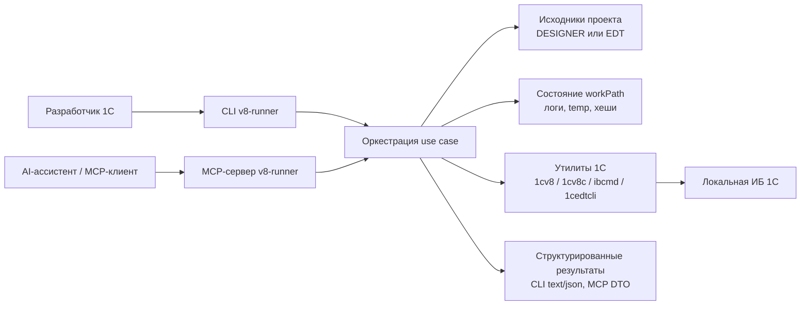

## 3. Контекст и границы системы

### 3.1 Бизнес-контекст

Система находится между деревом исходников, локальными рантаймами 1С и потребителями автоматизации. Она стандартизирует типовые сценарии в более узкий и управляемый интерфейс по сравнению с прямым вызовом утилит.

### 3.2 Технический контекст

Внешние интерфейсы:

- аргументы CLI и вывод в text/JSON;
- вызовы MCP tool по stdio и streamable HTTP;
- YAML-конфигурация;
- доступ к файловой системе для исходников проекта и `workPath`;
- запуск дочерних процессов для локальных утилит 1С;
- файловая или иная строка подключения к локальной информационной базе 1С.

### 3.3 Граница системы

Внутри границы:

- нормализация запросов;
- валидация конфигурации;
- оркестрация сценариев `build` / `test` / `dump` / `syntax` / `launch` / `init` / `extensions`;
- парсинг результатов тестов и синтаксических проверок;
- обработка транспортов и сессий MCP;
- анализ изменений и управление временными артефактами.

За пределами границы:

- реальное поведение компилятора и рантайма 1С;
- внутреннее устройство YaXUnit;
- планирование процессов операционной системой;
- установка и жизненный цикл локальных утилит 1С.
