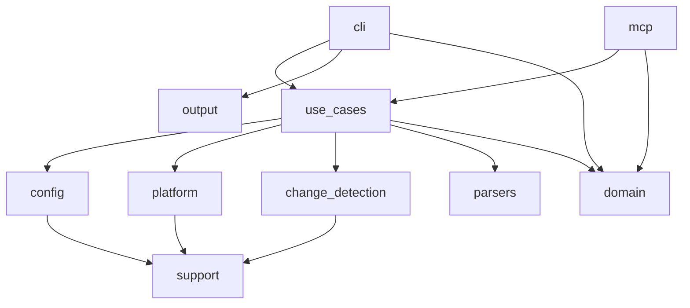

## 5. Представление строительных блоков

### 5.1 Уровень 1

Система организована в следующие крупные блоки:

- `cli`: разбор аргументов и CLI-специфичное представление результатов.
- `config`: загрузка и валидация YAML.
- `use_cases`: транспортно-нейтральная оркестрация и контекст выполнения.
- `mcp`: MCP DTO, сервисная граница, транспорты, параллелизм и управление сессиями.
- `platform`: поиск внешних инструментов и выполнение команд против утилит 1С.
- `change_detection`: инкрементальный анализ и сохранённое файловое состояние.
- `parsers`: преобразование сырых логов и отчётов в структурированные результаты.
- `domain` и `output`: общие модели результатов и CLI-примитивы представления.
- `support`: сквозные утилиты для файловой системы, логирования, temp и ошибок.

### 5.2 Уровень 2

#### `cli`

- Преобразует аргументы `clap` в транспортно-нейтральные запросы.
- Отвечает за разбор аргументов и CLI-специфичный рендеринг результатов.
- Публикует команды `init`, `extensions`, `build`, `test`, `dump`, `syntax`, `launch` и `mcp`.

#### `use_cases`

- Центральная оркестрация для `init`, `extensions`, `build`, `test`, `dump`, `syntax` и `launch`.
- Определяет transport-neutral request/result contracts, которые должны оставаться стабильной внутренней опорой для адаптеров и AI-агентов, работающих через эти адаптеры.

#### `mcp`

- Преобразует MCP tool-запросы в запросы use case.
- Публикует восемь текущих MCP-инструментов.
- Обрабатывает stdio- и HTTP-транспорты, трекинг сессий, лимиты параллелизма и общий EDT actor-path.
- Намеренно не публикует весь CLI: `init` и `extensions` остаются CLI-only сценариями.

#### `platform`

- Разрешает расположение инструментов.
- Строит аргументы подключения.
- Выполняет команды Designer, Enterprise, IBCMD и EDT.
- Изолирует реальную интеграцию с нестабильной внешней средой: файловой системой, процессами и локально установленными утилитами 1С.

#### `change_detection`

- Сканирует деревья исходников.
- Отслеживает хеши и timestamp.
- Группирует изменения по логическим `source-set`.
- Даёт оркестратору не просто список файлов, а сигнал для выбора partial/full стратегии.

#### `parsers`

- Парсит JUnit XML, runner-log, логи Designer validation и вывод EDT validation в структурированные результаты.

#### `domain` и `output`

- `domain` фиксирует общие структуры результата, используемые как минимум внутри use case и CLI.
- `output` содержит только presentation-layer примитивы и не должен становиться бизнес-слоем.
