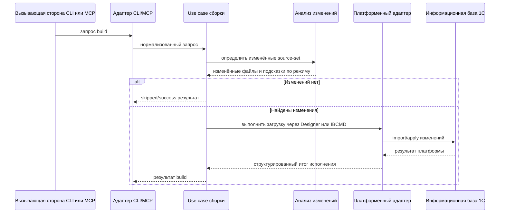
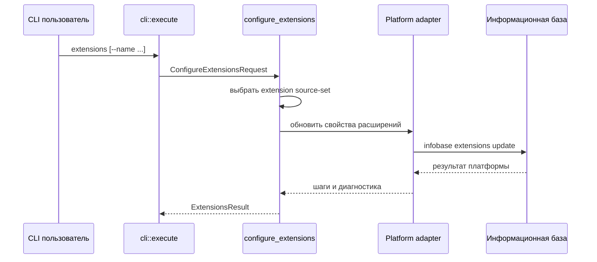

## 6. Представление времени выполнения

### 6.1 Сценарий `build`

Ключевые свойства выполнения:

- `CONFIGURATION` обрабатывается раньше расширений.
- Выбор между partial и full строится по анализу изменений и возможностям backend.
- Состояние сохраняется только после успешного выполнения.

### 6.2 Сценарий `test`

- `test` всегда начинается с `build`.
- Если сборка завершилась ошибкой, тесты не запускаются.
- Генерируется временный JSON-конфиг YaXUnit.
- Затем запускается Enterprise, а JUnit XML и runner-log разбираются в структурированные результаты.
- При сбое выполнения или разбора артефакты не уничтожаются молча: они сохраняются под `workPath/temp/yaxunit/runs/<run-id>/`.

### 6.3 Сценарий `extensions`

Ключевые свойства выполнения:

- Сценарий остаётся CLI-only и не публикуется как MCP tool.
- Работает только с `source-set` типа `EXTENSION`.
- Используется как более узкий operational path по сравнению с `build`, когда нужно синхронизировать свойства расширений без полной загрузки исходников.

### 6.4 Сценарий MCP EDT Syntax

- MCP-запрос приходит через stdio или HTTP.
- Глобальный admission control ограничивает параллельные tool-вызовы.
- `check_syntax_edt` идёт через общий менеджер EDT-сессии вместо one-shot исполнения.
- Ожидание в очереди, baseline reset/probe и выполнение команды используют один и тот же ограниченный бюджет таймаута.
- Отмена запроса может завершить клиентский путь раньше, чем фактическая серверная работа будет полностью дренирована.
