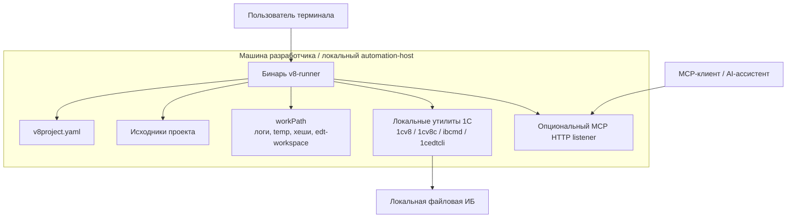

## 7. Представление развёртывания

Основная цель развёртывания — одна рабочая станция разработчика или локальный automation-host с доступом к файловой системе и установленными утилитами 1С.

Предположения по развёртыванию:

- процесс может запускать дочерние процессы;
- настроенный `workPath` доступен на запись;
- деревья исходников и пути к ИБ доступны локально;
- отдельный database service самому `v8-runner` не нужен;
- HTTP listener нужен только для MCP transport и не участвует в обычном CLI path.
