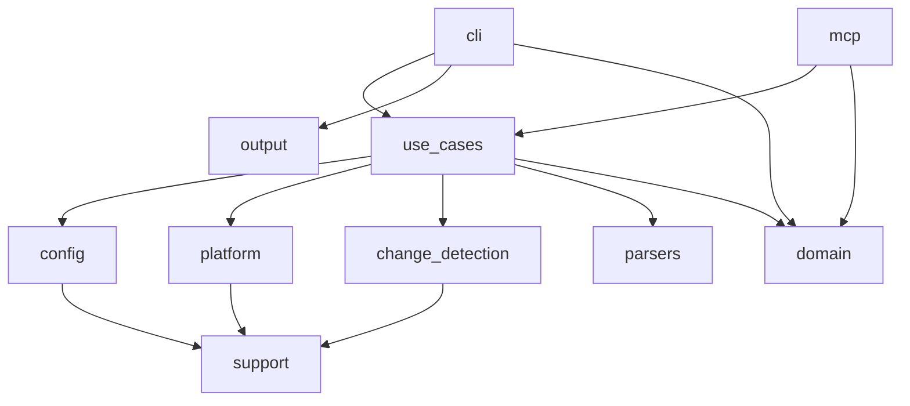

## 5. Представление строительных блоков

### 5.1 Уровень 1

Система организована в следующие крупные блоки:

- `cli`: разбор аргументов и CLI-специфичное представление результатов.
- `config`: загрузка typed YAML-контракта, defaults и ранняя валидация unsafe combinations.
- `use_cases`: транспортно-нейтральная оркестрация, контекст выполнения, workspace lock helpers и command-specific flows.
- `mcp`: MCP DTO, сервисная граница, транспорты, параллелизм и управление сессиями.
- `platform`: поиск внешних инструментов по версии/маске и выполнение команд против утилит 1С.
- `change_detection`: инкрементальный анализ и сохранённое файловое состояние.
- `parsers`: преобразование сырых логов и отчётов в структурированные результаты.
- `domain` и `output`: общие модели результатов, `ExecutionOutcome<T>` и CLI-примитивы представления.
- `support`: сквозные утилиты для файловой системы, staging/backup publication, логирования, temp и ошибок.

### 5.2 Уровень 2

#### `cli`

- Преобразует аргументы `clap` в транспортно-нейтральные запросы.
- Отвечает за разбор аргументов и CLI-специфичный рендеринг результатов.
- Публикует команды `config init`, `tools download`, `init`, `extensions`, `build`, `load`, `test`, `dump`, `convert`, `make`/`artifacts`, `syntax`, `launch` и `mcp`.

#### `use_cases`

- Центральная оркестрация для `config init`, `tools download`, `init`, `extensions`, `build`, `load`, `test`, `dump`, `convert`, `artifacts`, `syntax` и `launch`.
- Определяет transport-neutral request/result contracts, которые должны оставаться стабильной внутренней опорой для адаптеров и AI-агентов, работающих через эти адаптеры.
- Предоставляет workspace lock helper и internal unlocked entrypoints для nested flows вроде `test -> build`; public lock boundary остаётся в CLI/MCP adapters.
- Для runner-like сценариев собирает typed pipeline-like flow и заполняет `ExecutionOutcome<T>` вместо нового ad hoc result shape.
- Для `convert` выводит direction из `format`, резолвит `source-set` из `v8project.yaml` и публикует generated output либо под default `workPath/convert/out`, либо под explicit `--output` root с mirror-layout.
- Для `tools download <tool>` получает latest release metadata выбранного инструмента, скачивает sources/artifact, обновляет `v8project.local.yaml` для Vanessa/client MCP и при `yaxunit --sources` добавляет YAxUnit как project `source-set` `tests`.

#### `mcp`

- Преобразует MCP tool-запросы в запросы use case.
- Публикует восемь текущих MCP-инструментов.
- Обрабатывает stdio- и HTTP-транспорты, трекинг сессий, execution admission, HTTP session capacity и общий EDT actor-path.
- Намеренно не публикует весь CLI: `config init`, `tools download`, `init`, `extensions`, `load`, `convert` и `make`/`artifacts` остаются CLI-only сценариями.

#### `platform`

- Разрешает расположение инструментов.
- Строит аргументы подключения.
- Выполняет команды Designer, Enterprise, IBCMD и EDT.
- Изолирует реальную интеграцию с нестабильной внешней средой: файловой системой, процессами и локально установленными утилитами 1С.
- Возвращает platform-level results так, чтобы use case анализировали доменный итог, а не собирали сырые process arguments.

#### `change_detection`

- Сканирует деревья исходников.
- Отслеживает хеши и timestamp.
- Группирует изменения по логическим `source-set`.
- Даёт оркестратору не просто список файлов, а сигнал для выбора partial/full стратегии.

#### `parsers`

- Парсит JUnit XML, runner-log, логи Designer validation и вывод EDT validation в структурированные результаты.

#### `domain` и `output`

- `domain` фиксирует общие структуры результата, включая `ExecutionOutcome<T>`, `ExecutionStatus`, `ExecutionError`, metrics, artifacts и минимальный `StepResult`.
- `output` содержит только presentation-layer примитивы и не должен становиться бизнес-слоем.

#### `support`

- Содержит filesystem helpers для atomic-like replacement через staging/backup.
- Хранит metadata sidecars для staging/backup cleanup и не должен превращать internal temp naming в публичный API.
