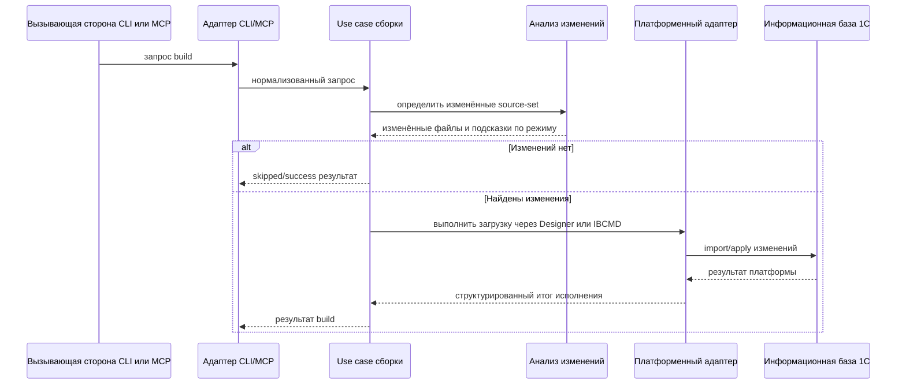
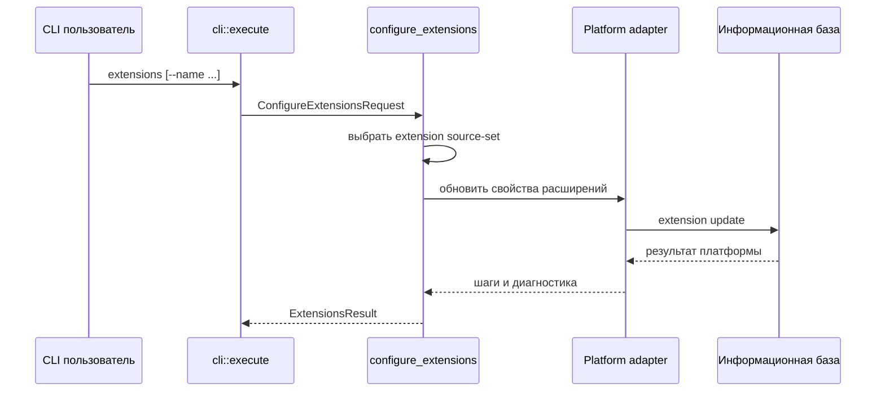
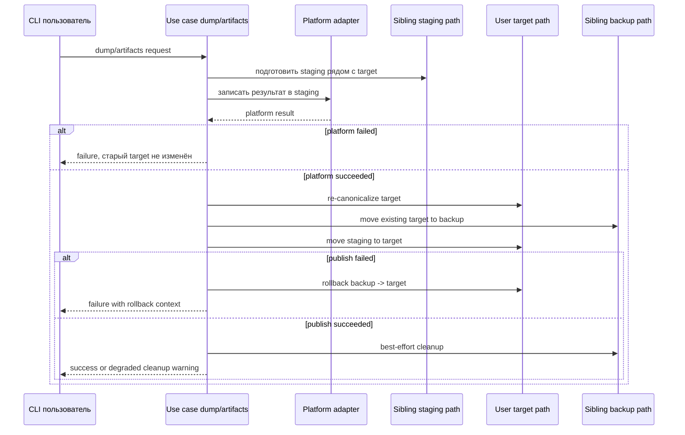

## 6. Представление времени выполнения

### 6.1 Сценарий `build`

Ключевые свойства выполнения:

- Public CLI/MCP boundary должен владеть workspace lock для canonical `workPath` до dispatch use case.
- `CONFIGURATION` обрабатывается раньше расширений.
- Выбор между partial и full строится по анализу изменений и возможностям backend.
- Состояние сохраняется только после успешного выполнения.
- Для EDT source-set export decision и generated Designer load decision используют разные change-detection contexts.

### 6.2 Сценарий `test`

- `test` всегда начинается с `build`.
- Внешний command boundary владеет workspace lock, а вложенный `build` вызывается через explicit unlocked entrypoint.
- Если сборка завершилась ошибкой, тесты не запускаются.
- Генерируется временный JSON-конфиг YaXUnit.
- Затем запускается Enterprise, а JUnit XML и runner-log разбираются в структурированные результаты.
- При сбое выполнения или разбора артефакты не уничтожаются молча: они сохраняются под `workPath/temp/yaxunit/runs/<run-id>/`.
- Итог тестового runner-like сценария должен выражаться через `ExecutionOutcome<TestReport>` и сохранять structured errors, diagnostics, metrics and retained artifacts.

### 6.3 Сценарий `extensions`

Ключевые свойства выполнения:

- Сценарий остаётся CLI-only и не публикуется как MCP tool.
- Работает только с `source-set` типа `EXTENSION`.
- Используется как более узкий operational path по сравнению с `build`, когда нужно синхронизировать свойства расширений без полной загрузки исходников.
- Так как операция мутирует ИБ, будущая общая execution policy должна помечать соответствующий platform step как critical DB phase.

### 6.4 Сценарий `tools download`

- CLI adapter получает workspace lock, потому что команда меняет primary config, local overlay и
  локальные tool directories.
- Use case читает latest release metadata для выбранной команды: `yaxunit`, `vanessa` или
  `client-mcp`.
- Для `yaxunit --sources` распаковывается source subtree в `tests`; primary config получает
  `source-set` `tests`, если его ещё нет. Без `--sources` скачивается `.cfe` в `build/tools`.
- Для `client-mcp --sources` распаковывается source subtree в
  `build/tools/onec-client-mcp-devkit/exts/client-mcp`; без `--sources` команда требует
  `builder=DESIGNER` и скачивает `.cfe` в `build/tools`.
- Vanessa Automation single материализуется командой `vanessa` как
  `build/tools/vanessa-automation-single.epf`.
- `v8project.local.yaml` обновляется machine-local настройками `tools.va.epf_path` для
  `vanessa` и `tools.client_mcp.extension` для `client-mcp`; загрузка не устанавливает
  расширения в ИБ, не подменяет `build` и при `--force` заменяет только managed targets,
  созданные этой командой.
- Managed target фиксируется sidecar marker-файлом до publish phase. Если публикация скачанного
  файла или каталога завершается ошибкой, новый marker очищается, чтобы следующий запуск не считал
  неуспешный target управляемым.
- HTTP download path ограничивает response body 512 MiB и прерывает сценарий до распаковки или
  публикации, если release asset или source archive превышает лимит.

### 6.5 Сценарий MCP EDT Syntax

- MCP-запрос приходит через stdio или HTTP.
- Глобальный admission control ограничивает параллельные tool-вызовы.
- `check_syntax_edt` идёт через общий `platform::edt_session` manager вместо one-shot исполнения; тот же actor также используется CLI interactive EDT use cases.
- Ожидание в очереди, baseline reset/probe и выполнение команды используют один и тот же ограниченный бюджет таймаута.
- Host policy различается: MCP может отпустить caller после running cancel/timeout и дождаться terminal state асинхронно внутри shared actor, а CLI blocking adapter ждёт terminal cleanup или завершает собственный short-lived manager принудительно перед возвратом.

### 6.6 Full Replacement `dump` / `artifacts` Publication

Ключевые свойства выполнения:

- Staging и backup находятся рядом с target, чтобы не переходить границу файловой системы при rename.
- Orphan cleanup может удалять только stale staging/backup paths с metadata `tool=v8-runner` и matching target identity.
- `dump incremental` и `dump partial` не получают full replacement guarantee и остаются non-atomic update modes.
- Publication phase после переноса старого target в backup является filesystem critical phase.

### 6.7 Command Boundary, Admission и Cancellation

- CLI и MCP используют разные public surfaces, но сходятся в transport-neutral use case boundary.
- MCP tool call сначала проходит execution admission; HTTP session capacity проверяется отдельно на transport lifecycle.
- После admission команда, работающая с `workPath`, должна получить workspace lock до запуска use case.
- Timeout budget должен покрывать очередь/admission, подготовку, platform work, сбор логов, cleanup и mapping результата.
- Nested orchestration наследует оставшийся deadline outer command.
- Mutating DB operations после входа в critical phase не должны получать default hard kill; cancellation/timeout записывается как requested и команда ждёт terminal outcome.
